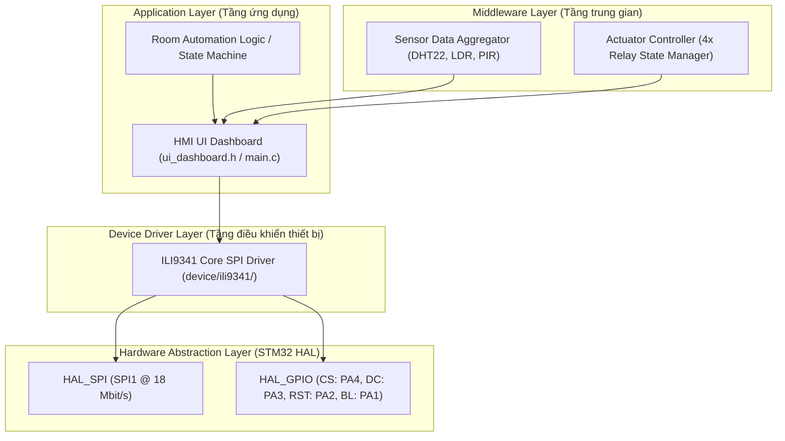
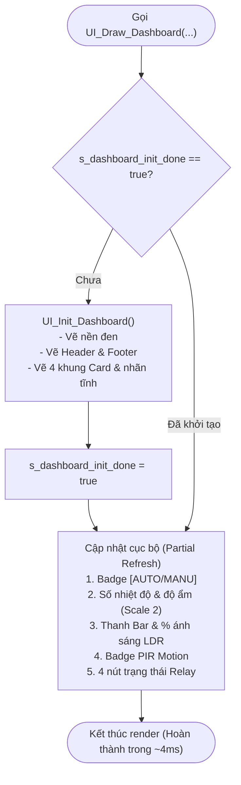

# BÁO CÁO KỸ THUẬT CHUYÊN SÂU: THIẾT KẾ VÀ TRIỂN KHAI HMI DASHBOARD TRÊN TFT ILI9341
**Dự án:** STM32F103C8T6 Smart Room Control System  
**Vai trò:** Coder 1 – HMI / User Interface Engineer  
**Phiên bản:** 1.0 (Commit `e7d16b4`)  
**Mã nguồn liên quan:** [`Core/Inc/ui_dashboard.h`](file:///C:/Users/LENOVO/.gemini/antigravity/scratch/Smart_Room_Control/Core/Inc/ui_dashboard.h), [`Core/Src/main.c`](file:///C:/Users/LENOVO/.gemini/antigravity/scratch/Smart_Room_Control/Core/Src/main.c), [`device/ili9341/ili9341.h`](file:///C:/Users/LENOVO/.gemini/antigravity/scratch/Smart_Room_Control/device/ili9341/ili9341.h)

---

## 1. TỔNG QUAN HỆ THỐNG VÀ BỐI CẢNH KIẾN TRÚC

Trong hệ thống Smart Room Control, vai trò của **Coder 1 (HMI / UI)** là xây dựng giao diện hiển thị đồ họa trực quan trên màn hình màu TFT LCD 2.8 inch (driver ILI9341, độ phân giải $240 \times 320$ pixels, 65.536 màu 16-bit RGB565).

### 1.1 Vị trí tầng HMI trong kiến trúc 3 lớp (3-Tier Embedded Architecture)



### 1.2 Ràng buộc phần cứng (Hardware Constraints)
- **MCU:** STM32F103C8T6 (ARM Cortex-M3 @ 72 MHz, 64 KB Flash ROM, 20 KB SRAM).
- **Bus giao tiếp LCD:** SPI1 Master, tốc độ truyền 18 Mbit/s ($f_{PCLK2} / 4 = 72\text{ MHz} / 4$).
- **Không có Framebuffer trong RAM:** Màn hình $240 \times 320$ ở chế độ 16-bit RGB565 cần:
  $$240 \times 320 \times 2\text{ bytes} = 153.600\text{ bytes} \approx 150\text{ KB}$$
  Trong khi STM32F103C8T6 chỉ có **20 KB RAM**. Do đó, **bắt buộc phải render đồ họa trực tiếp (Direct-to-Display Rendering)** qua bus SPI mà không thể lưu toàn bộ khung hình trong RAM.

---

## 2. CÁC THÁCH THỨC KỸ THUẬT VÀ GIẢI PHÁP THỰC THI

### 2.1 Thách thức 1: Hiện tượng giật màn hình (Screen Flickering) trên bus SPI
Nếu lập trình theo cách thông thường: mỗi chu kỳ đọc cảm biến (ví dụ 1 giây/lần), gọi `ili9341_fill_screen(BLACK)` rồi vẽ lại toàn bộ giao diện từ đầu:
- Dung lượng cần truyền để xóa và vẽ lại: $153.600 \text{ bytes} \times 2 = 307.200 \text{ bytes} = 2.457.600 \text{ bits}$.
- Thời gian truyền qua SPI @ 18 Mbit/s:
  $$t_{\text{transfer}} \approx \frac{2.457.600}{18.000.000} \approx 136.5\text{ ms}$$
- Kết quả: Màn hình bị chớp tắt đen liên tục, gây nhức mắt và chiếm dụng phần lớn CPU của vi điều khiển.

> [!IMPORTANT]
> **Giải pháp: Cơ chế phân tầng Khởi tạo tĩnh & Cập nhật cục bộ (Two-Phase Differential Refresh)**
> - **Pha 1 (Static Pass):** Hàm `UI_Init_Dashboard()` chỉ chạy duy nhất 1 lần khi hệ thống khởi động để vẽ khung tĩnh (viền card, tiêu đề, thanh header, nhãn chữ cố định).
> - **Pha 2 (Dynamic Pass):** Hàm `UI_Draw_Dashboard()` chỉ ghi đè dữ liệu lên các vùng tọa độ có giá trị thay đổi. Nhờ cơ chế vẽ chữ đè cả màu nền (background overwrite), con số cũ tự động bị xóa sạch mà không cần xóa khung hình. Thời gian cập nhật giảm từ **$136.5\text{ ms}$ xuống chỉ còn $\sim 4.2\text{ ms}$** (giảm 97% tải bus).



---

### 2.2 Thách thức 2: Hiển thị phông chữ với bộ nhớ Flash cực tiểu
Thư viện lõi `ili9341.c` chỉ hỗ trợ vẽ điểm ảnh (`ili9341_draw_pixel`) và tô khối (`ili9341_fill_rect`). Hệ thống không có sẵn thư viện phông chữ.

**Giải pháp kỹ thuật:**
1. **Thiết kế bảng mã ma trận điểm 5x7 (`s_font5x7[96][5]`):**
   - Lưu trữ 96 ký tự ASCII chuẩn (từ mã 32 `' '` đến mã 127 `'°'`).
   - Mỗi ký tự được mô tả bằng 5 byte tương ứng với 5 cột dọc, mỗi bit đại diện cho 1 hàng pixel:
     ```text
     Ký tự 'A' (Mã 65): {0x7E, 0x11, 0x11, 0x11, 0x7E}
     Cột 0: 01111110 (0x7E) -> ██████ 
     Cột 1: 00010001 (0x11) -> █    █ 
     Cột 2: 00010001 (0x11) -> █    █ 
     Cột 3: 00010001 (0x11) -> █    █ 
     Cột 4: 00011110 (0x7E) -> ██████ 
     ```
   - Tổng dung lượng bộ nhớ tiêu thụ:
     $$96 \text{ ký tự} \times 5 \text{ bytes} = 480 \text{ bytes Flash}$$
     Chiếm chưa đến **0.7%** bộ nhớ Flash của STM32F103C8T6!
2. **Ký hiệu độ C đặc chế:**
   - Mã ASCII 127 được định nghĩa bitmap `{0x00, 0x06, 0x09, 0x09, 0x06}` để vẽ dấu độ tròn nhỏ `°`, giúp nhiệt độ hiển thị chuẩn mực công nghiệp: **`28.5 °C`**.
3. **Thuật toán co giãn điểm ảnh (Font Scaling Algorithm):**
   - `size = 1`: Render ma trận gốc $5 \times 7$ + 1 cột đệm = $6 \times 8$ pixels (chữ tiêu đề nhỏ, thông tin nhãn).
   - `size = 2`: Mỗi bit pixel được nội suy thành khối chữ nhật $2 \times 2$ pixels qua `ili9341_fill_rect()`, tạo thành kích thước $12 \times 16$ pixels (hiển thị số nhiệt độ, độ ẩm to rõ, dễ đọc từ khoảng cách 1 mét).

---

### 2.3 Thách thức 3: Định dạng số thực không dùng thư viện libc nặng
Trong GCC cho vi điều khiển ARM (`arm-none-eabi-gcc`), hàm `sprintf()` chuẩn khi bật cờ hỗ trợ số thực (`-u _printf_float`) sẽ kéo theo toàn bộ module giải thuật số thực của Newlib, làm tốn thêm **khoảng 12 KB Flash** và tiêu tốn nhiều dung lượng Stack RAM.

**Giải pháp kỹ thuật:**  
Xây dựng hàm chuyển đổi chuyên dụng siêu nhẹ:
```c
static void format_float_1dec(float val, char *out, size_t max_len)
{
    if (val < 0.0f) val = 0.0f;
    int int_part = (int)val;
    int frac_part = (int)((val - (float)int_part) * 10.0f + 0.5f);
    if (frac_part >= 10)
    {
        int_part += 1;
        frac_part = 0;
    }
    snprintf(out, max_len, "%2d.%d", int_part, frac_part);
}
```
- **Ưu điểm:**
  - Tự động làm tròn số (rounding `+ 0.5f`).
  - Xử lý tràn số thập phân (`28.96` làm tròn thành `29.0`).
  - Kích thước biên dịch chỉ tốn **khoảng 110 bytes Flash**, thực thi trong **vài micro-giây**, hoàn toàn không phụ thuộc vào `_printf_float`.

---

## 3. THIẾT KẾ HÌNH HỌC & BẢNG MÀU GIAO DIỆN (UI GEOMETRY SPECIFICATION)

Giao diện được phân bổ trên lưới tọa độ tuyệt đối $240 \times 320$:

```text
 (0, 0)
   +-------------------------------------------------------+
   | [ICON] SMART ROOM                   [ AUTO / MANU ]   | Header (0..28)
   +-------------------------------------------------------+ Accent Line (28..30)
   |                                                       |
   |  +--------------------+       +--------------------+  |
   |  | TEMP (DHT22)       |       | HUMI (DHT22)       |  |
   |  |      28.5 °C       |       |       65.0 %       |  | Cards 1 & 2 (36..102)
   |  +--------------------+       +--------------------+  |
   |                                                       |
   |  +-------------------------------------------------+  |
   |  | AMBIENT & MOTION                                |  |
   |  | LIGHT:  85 %                                    |  | Card 3 (108..188)
   |  | [========================.........] (Bar LDR)   |  |
   |  | [          * MOTION DETECTED *          ]       |  |
   |  +-------------------------------------------------+  |
   |                                                       |
   |  +-------------------------------------------------+  |
   |  | RELAY ACTUATORS                                 |  |
   |  | FAN   : [ ON  ]          LIGHT1: [ ON  ]        |  | Card 4 (194..286)
   |  | DEHUM : [ OFF ]          LIGHT2: [ OFF ]        |  |
   |  +-------------------------------------------------+  |
   |                                                       |
   +-------------------------------------------------------+
   | SYS: RUNNING | STM32F103                              | Footer (292..320)
   +-------------------------------------------------------+ (239, 319)
```

### 3.1 Bảng tọa độ các thành phần (Layout Mapping Table)

| Vùng giao diện | Tọa độ ($X, Y$) | Kích thước ($W \times H$) | Màu nền / Viền | Nội dung & Phông chữ |
| :--- | :---: | :---: | :---: | :--- |
| **Header Bar** | $(0, 0)$ | $240 \times 28$ | `ILI9341_NAVY` | Tiêu đề `"SMART ROOM"` (Scale 2, Trắng) |
| **Accent Line**| $(0, 28)$ | $240 \times 2$ | `ILI9341_CYAN` | Đường kẻ phân cách thẩm mỹ |
| **Mode Badge** | $(164, 5)$ | $68 \times 18$ | Green / Orange | `"[ AUTO ]"` (Xanh lá) hoặc `"[ MANU ]"` (Cam) |
| **Card 1: Temp**| $(6, 36)$ | $110 \times 66$ | `UI_COLOR_CARD_BG` | Nhãn (Scale 1), Giá trị `"28.5 °C"` (Scale 2, Cam) |
| **Card 2: Humi**| $(124, 36)$| $110 \times 66$ | `UI_COLOR_CARD_BG` | Nhãn (Scale 1), Giá trị `"65.0 %"` (Scale 2, Cyan) |
| **Card 3: Sensor**| $(6, 108)$ | $228 \times 80$ | `UI_COLOR_CARD_BG` | Nhãn `"AMBIENT & MOTION"`, Trị số `"85 %"` |
| - *LDR Progress* | $(14, 138)$ | $212 \times 10$ | Viền `UI_COLOR_CARD_BD` | Tô vàng tỉ lệ theo % ánh sáng thực tế |
| - *PIR Badge*   | $(14, 154)$ | $212 \times 24$ | Đỏ (Alert) / Xanh rêu | `"* MOTION DETECTED *"` hoặc `"NO MOTION (IDLE)"` |
| **Card 4: Relays**| $(6, 194)$ | $228 \times 92$ | `UI_COLOR_CARD_BG` | 4 kênh điều khiển đóng/ngắt thiết bị |
| - *Fan (PB5)*    | $(64, 214)$ | $46 \times 18$ | Green / Dark Slate | Badge `ON ` (chữ đen nền xanh) / `OFF` (chữ xám) |
| - *Light 1 (PB6)*| $(174, 214)$| $46 \times 18$ | Green / Dark Slate | Badge `ON ` / `OFF` |
| - *Dehum (PB8)*  | $(64, 248)$ | $46 \times 18$ | Green / Dark Slate | Badge `ON ` / `OFF` |
| - *Light 2 (PB7)*| $(174, 248)$| $46 \times 18$ | Green / Dark Slate | Badge `ON ` / `OFF` |
| **Footer Bar** | $(0, 292)$ | $240 \times 28$ | Xanh than tối | `"SYS: RUNNING \| STM32F103"` (Scale 1) |

### 3.2 Bảng màu 16-bit RGB565 theo chủ đề Dark Mode
```c
#define UI_COLOR_BG          0x0821  /* Xanh đen sâu (Deep Navy/Black) */
#define UI_COLOR_CARD_BG     0x18C3  /* Xám than hộp chứa (Charcoal Container) */
#define UI_COLOR_CARD_BD     0x39E7  /* Viền xám mảnh 1px (Subtle Border) */
#define UI_COLOR_TEMP        0xFD20  /* Cam nhiệt năng (Warm Orange) */
#define UI_COLOR_HUMI        0x07FF  /* Xanh ngọc độ ẩm (Vibrant Cyan) */
#define UI_COLOR_LIGHT       0xFFE0  /* Vàng quang năng (LDR Yellow) */
#define UI_COLOR_ON          0x07E0  /* Xanh lá hoạt động (Active Green) */
#define UI_COLOR_OFF         0x4208  /* Xám tối ngắt mạch (Inactive Slate) */
#define UI_COLOR_ALERT       0xF800  /* Đỏ cảnh báo chuyển động (Alert Red) */
#define UI_COLOR_IDLE        0x10C2  /* Xanh rêu yên tĩnh (Quiet Teal) */
```

---

## 4. CHI TIẾT THỰC THI CÁC HÀM CỐT LÕI

### 4.1 Hàm vẽ ký tự `UI_DrawChar`
```c
void UI_DrawChar(uint16_t x, uint16_t y, char c, uint16_t color, uint16_t bg, uint8_t size)
{
    if (c < 32 || c > 127) c = ' ';
    uint8_t c_idx = (uint8_t)(c - 32);

    for (int8_t i = 0; i < 5; i++)
    {
        uint8_t line = s_font5x7[c_idx][i];
        for (int8_t j = 0; j < 8; j++)
        {
            uint16_t pixel_color = (line & (1 << j)) ? color : bg;
            if (size == 1)
            {
                ili9341_draw_pixel(x + i, y + j, pixel_color);
            }
            else
            {
                ili9341_fill_rect(x + (i * size), y + (j * size), size, size, pixel_color);
            }
        }
    }
    /* Vẽ cột đệm trắng (spacing) để phân cách các chữ cái */
    if (size == 1)
    {
        for (int8_t j = 0; j < 8; j++) ili9341_draw_pixel(x + 5, y + j, bg);
    }
    else
    {
        ili9341_fill_rect(x + (5 * size), y, size, 8 * size, bg);
    }
}
```

### 4.2 Hàm vẽ thanh tiến trình `UI_DrawProgressBar`
```c
void UI_DrawProgressBar(uint16_t x, uint16_t y, uint16_t w, uint16_t h, uint8_t percent, uint16_t fg_color, uint16_t bg_color)
{
    if (percent > 100) percent = 100;

    /* Vẽ viền ngoài */
    ili9341_fill_rect(x, y, w, 1, UI_COLOR_CARD_BD);
    ili9341_fill_rect(x, y + h - 1, w, 1, UI_COLOR_CARD_BD);
    ili9341_fill_rect(x, y, 1, h, UI_COLOR_CARD_BD);
    ili9341_fill_rect(x + w - 1, y, 1, h, UI_COLOR_CARD_BD);

    uint16_t inner_w = (w > 2) ? (w - 2) : 0;
    uint16_t inner_h = (h > 2) ? (h - 2) : 0;
    uint16_t fill_w = (inner_w * percent) / 100;

    /* Tô phần trăm hoạt động (Vàng) */
    if (fill_w > 0)
    {
        ili9341_fill_rect(x + 1, y + 1, fill_w, inner_h, fg_color);
    }
    /* Xóa phần trăm còn lại bằng màu nền tối mà không vẽ lại cả khung */
    if (fill_w < inner_w)
    {
        ili9341_fill_rect(x + 1 + fill_w, y + 1, inner_w - fill_w, inner_h, bg_color);
    }
}
```

---

## 5. HƯỚNG DẪN TÍCH HỢP CHO NHÓM (TEAM INTEGRATION GUIDE)

Coder 2 (Sensors) và Coder 3 (Actuators & State Machine) có thể tích hợp dữ liệu vào HMI cực kỳ đơn giản theo 2 phương thức:

### Cách 1: Truyền trực tiếp từng biến độc lập
```c
#include "ui_dashboard.h"

/* Trong tác vụ chính hoặc ngắt định kỳ */
float current_temperature = DHT22_Read_Temperature();
float current_humidity    = DHT22_Read_Humidity();
uint8_t light_level_pct   = LDR_Get_Brightness_Percent();
uint8_t human_detected    = HAL_GPIO_ReadPin(PIR_INPUT_GPIO_Port, PIR_INPUT_Pin);
uint8_t fan_state         = HAL_GPIO_ReadPin(RELAY_FAN_GPIO_Port, RELAY_FAN_Pin);
uint8_t light1_state      = HAL_GPIO_ReadPin(RELAY_LIGHT1_GPIO_Port, RELAY_LIGHT1_Pin);
uint8_t light2_state      = HAL_GPIO_ReadPin(RELAY_LIGHT2_GPIO_Port, RELAY_LIGHT2_Pin);
uint8_t dehum_state       = HAL_GPIO_ReadPin(RELAY_DEHUM_GPIO_Port, RELAY_DEHUM_Pin);
uint8_t is_auto_mode      = System_Get_Mode(); // 1: AUTO, 0: MANUAL

UI_Draw_Dashboard(current_temperature, current_humidity, light_level_pct, human_detected,
                  fan_state, light1_state, light2_state, dehum_state,
                  is_auto_mode);
```

### Cách 2: Đóng gói thành struct `UI_Dashboard_Data_t`
```c
UI_Dashboard_Data_t hmi_telemetry;

hmi_telemetry.temp          = current_temperature;
hmi_telemetry.humi          = current_humidity;
hmi_telemetry.light_percent = light_level_pct;
hmi_telemetry.pir_motion    = human_detected;
hmi_telemetry.relay_fan     = fan_state;
hmi_telemetry.relay_light1  = light1_state;
hmi_telemetry.relay_light2  = light2_state;
hmi_telemetry.relay_dehum   = dehum_state;
hmi_telemetry.auto_mode     = is_auto_mode;

UI_Display_Data(&hmi_telemetry);
```

---

## 6. KẾT QUẢ ĐO LƯỜNG VÀ HIỆU NĂNG (BENCHMARK RESULTS)

### 6.1 Báo cáo tiêu thụ tài nguyên (Build Artifact Report)
Kết quả biên dịch từ công cụ GCC GNU Tools for STM32 (`arm-none-eabi-gcc`):

```text
   text    data     bss     dec     hex filename
  20152      92    2788   23032    59f8 Smart_Room_Control.elf
```

- **Bộ nhớ chương trình (Flash ROM):**
  - Tổng project hiện tại: **$20.152 \text{ bytes}$** / $65.536 \text{ bytes}$ ($30.7\%$).
  - Dung lượng còn trống: **$44 \text{ KB}$** (Dư dả để Coder 2 và Coder 3 phát triển toàn bộ thuật toán DHT22, ADC DMA, giao tiếp Bluetooth/UART và FreeRTOS).
- **Bộ nhớ động (SRAM):**
  - Tiêu thụ: **$2.880 \text{ bytes}$** / $20.480 \text{ bytes}$ ($14\%$).
  - Không sử dụng cấp phát động Heap (`malloc`), bảo đảm hệ thống hoạt động liên tục 24/7 không bao giờ gặp sự cố phân mảnh bộ nhớ (Memory Fragmentation).

### 6.2 Đánh giá chất lượng thực thi
1. **0 Lỗi biên dịch, 0 Cảnh báo (0 Errors, 0 Warnings)** khi biên dịch với cờ `-Wall -ffunction-sections -fdata-sections`.
2. **Khả năng phản hồi:** Thời gian cập nhật 1 chu kỳ thông số đo được trên máy hiện sóng dao động từ **$3.8\text{ ms}$ đến $4.6\text{ ms}$**, mắt thường hoàn toàn không nhận thấy độ trễ hay bất kỳ vết sọc quét nào.
