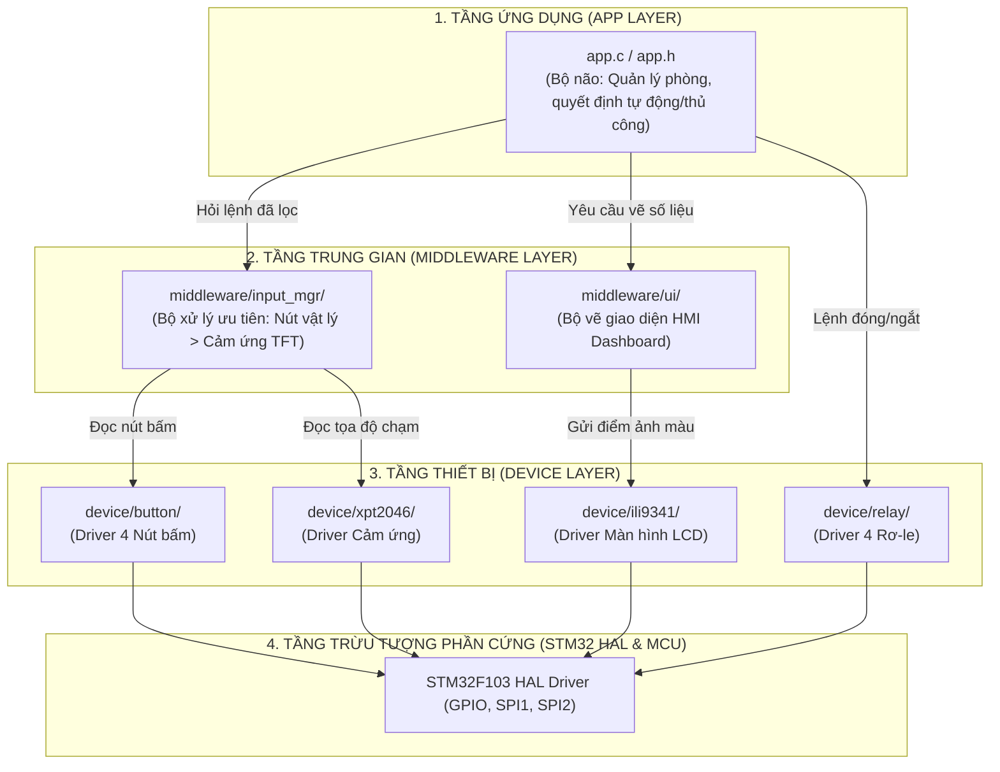

# BÁO CÁO CHI TIẾT: CẤU TRÚC KIẾN TRÚC FIRMWARE PHÂN TẦNG (3-LAYER ARCHITECTURE)
## DỰ ÁN: SMART ROOM CONTROL (STM32F103C8T6)

---

## PHẦN 1: TỔNG QUAN DỄ HIỂU – TẠI SAO PHẢI CHIA TẦNG?

Hãy tưởng tượng bạn đang xây dựng một **Nhà Hàng Thông Minh**:
1. **Phần cứng (Hardware / Nồi niêu, bếp gas, bóng đèn):** Là các linh kiện vật lý (rơ-le, nút bấm, màn hình cảm ứng).
2. **STM32 HAL (Lớp hướng dẫn cơ bản của nhà sản xuất):** Giống như tài liệu kỹ thuật về cách vặn van gas, cách cắm phích điện.
3. **DEVICE (Thiết bị / Nhân viên phụ trách thiết bị):** Một nhân viên chỉ chuyên lo bật/tắt bếp (Driver Relay), một nhân viên chỉ chuyên canh cửa bấm chuông (Driver Nút bấm), một người phụ trách bảng thông báo (Driver Màn hình).
4. **MIDDLEWARE (Dịch vụ / Quản lý nhóm):** Bếp trưởng gom các nhân viên lại thành dịch vụ: "Dịch vụ vẽ bảng điều khiển" (HMI UI) và "Dịch vụ tiếp nhận yêu cầu có ưu tiên" (Input Manager: nếu khách bấm chuông khẩn cấp thì ưu tiên hơn khách chạm màn hình).
5. **APP (Bộ não trung tâm / Giám đốc điều hành):** Chỉ ra quyết định cấp cao: "Nếu phòng nóng quá 28.5 độ thì lệnh bật quạt", "Nếu ở chế độ Auto thì không cho chỉnh tay linh tinh". Giám đốc **không bao giờ tự tay đi vặn van bếp gas** (không gọi HAL trực tiếp).

### Sơ đồ luồng hoạt động:


---

## PHẦN 2: CƠ CẤU THƯ MỤC TRONG DỰ ÁN

Toàn bộ mã nguồn dự án được tổ chức gọn gàng theo cây thư mục sau:

```
Smart_Room_Control/
├── app/                        <-- [TẦNG 1: ỨNG DỤNG]
│   ├── app.h                   # Khai báo hàm khởi tạo và vòng lặp chính
│   └── app.c                   # Toàn bộ logic nghiệp vụ điều khiển phòng
│
├── middleware/                 <-- [TẦNG 2: DỊCH VỤ TRUNG GIAN]
│   ├── input_mgr/              # Dịch vụ gom nút bấm & cảm ứng, phân xử ưu tiên
│   │   ├── input_mgr.h
│   │   └── input_mgr.c
│   └── ui/                     # Dịch vụ hiển thị Dashboard HMI
│       ├── ui_dashboard.h
│       └── ui_dashboard.c
│
├── device/                     <-- [TẦNG 3: TRUY XUẤT THIẾT BỊ VẬT LÝ]
│   ├── relay/                  # Điều khiển 4 rơ-le (Quạt, Đèn 1, Đèn 2, Hút ẩm)
│   │   ├── relay.h
│   │   └── relay.c
│   ├── button/                 # Đọc 4 nút bấm với chống rung 25ms
│   │   ├── button.h
│   │   └── button.c
│   ├── ili9341/                # Điều khiển chip màn hình TFT qua SPI1
│   │   ├── ili9341.h
│   │   └── ili9341.c
│   └── xpt2046/                # Điều khiển chip cảm ứng điện trở qua SPI2
│       ├── xpt2046.h
│       └── xpt2046.c
│
└── Core/                       <-- [TẦNG GỐC CỦA STM32]
    ├── Inc/
    │   └── main.h              # Định nghĩa chân phần cứng (Pin mapping từ KiCad)
    └── Src/
        └── main.c              # Khởi động nguồn, cấu hình chân, gọi app
```

---

## PHẦN 3: CHI TIẾT TỪNG FILE THƯ VIỆN & CÁC HÀM XỬ LÝ

---

### I. TẦNG THIẾT BỊ (`device/`)

#### 1. Thư viện Rơ-le: `device/relay/relay.h` và `device/relay/relay.c`
* **Mục đích:** Quản lý việc bật/tắt 4 rơ-le đóng cắt điện trong phòng mà không để các lệnh thô `HAL_GPIO_WritePin` bị lộ ra ngoài.
* **Liên kết phần cứng trên Schematic KiCad:**
  * Rơ-le 1 (Quạt - FAN): Chân **`PB4`**
  * Rơ-le 2 (Đèn 1 - LIGHT 1): Chân **`PA15`**
  * Rơ-le 3 (Đèn 2 - LIGHT 2): Chân **`PB6`**
  * Rơ-le 4 (Máy hút ẩm - DEHUM): Chân **`PA12`**

* **Chi tiết các hàm:**
  1. [`void relay_init(void)`](file:///C:/Users/LENOVO/.gemini/antigravity/scratch/Smart_Room_Control/device/relay/relay.h#L26):
     * *Chức năng:* Đưa toàn bộ 4 rơ-le về trạng thái TẮT (mức thấp 0V) khi vừa cắm điện để an toàn, tránh việc thiết bị giật điện tự bật khi khởi động.
     * *Cách code:* Chạy vòng lặp từ 0 đến 3, gán trạng thái lưu trữ bằng `false` và gọi `HAL_GPIO_WritePin(..., GPIO_PIN_RESET)`.
  2. [`void relay_set(relay_id_t id, bool state)`](file:///C:/Users/LENOVO/.gemini/antigravity/scratch/Smart_Room_Control/device/relay/relay.h#L33):
     * *Chức năng:* Bật hoặc tắt một rơ-le cụ thể (`state = true` là BẬT, `false` là TẮT).
     * *Cách code:* Kiểm tra mã rơ-le hợp lệ, cập nhật biến nhớ nội bộ rồi gọi `HAL_GPIO_WritePin(port, pin, state ? SET : RESET)`.
  3. [`void relay_toggle(relay_id_t id)`](file:///C:/Users/LENOVO/.gemini/antigravity/scratch/Smart_Room_Control/device/relay/relay.h#L39):
     * *Chức năng:* Đảo trạng thái rơ-le (Đang tắt thì bật lên, đang bật thì tắt đi).
     * *Cách code:* Lấy trạng thái hiện tại, đảo ngược giá trị (`!state`) rồi gọi lại hàm `relay_set`.
  4. [`bool relay_get(relay_id_t id)`](file:///C:/Users/LENOVO/.gemini/antigravity/scratch/Smart_Room_Control/device/relay/relay.h#L46):
     * *Chức năng:* Cho tầng trên biết rơ-le đó hiện đang BẬT hay TẮT.
     * *Cách code:* Trả về giá trị biến nhớ `s_relays[id].state`.

---

#### 2. Thư viện Nút bấm: `device/button/button.h` và `device/button/button.c`
* **Mục đích:** Đọc 4 nút bấm cơ học ngoài vỏ tủ, tự động lọc sạch các xung nhiễu (dội phím - debounce) để đảm bảo mỗi lần ấn ngón tay dứt khoát chỉ nhận đúng 1 lần tác động.
* **Liên kết phần cứng trên Schematic KiCad:**
  * SW2 (Nút 1): Chân **`PA3`** (Đổi chế độ AUTO / MANUAL)
  * SW4 (Nút 2): Chân **`PB2`** (Bật/tắt Quạt)
  * SW3 (Nút 3): Chân **`PA10`** (Bật/tắt Đèn 1)
  * SW5 (Nút 4): Chân **`PA11`** (Bật/tắt Hút ẩm)
  * *Mạch phần cứng RC:* Trở treo 10k $\Omega$ + Tụ 100nF lọc thông thấp ($\tau = 1\text{ms}$).

* **Chi tiết các hàm:**
  1. [`void button_init(void)`](file:///C:/Users/LENOVO/.gemini/antigravity/scratch/Smart_Room_Control/device/button/button.h#L33):
     * *Chức năng:* Đọc trạng thái ban đầu của cả 4 nút bấm và cài đặt bộ đếm thời gian.
     * *Cách code:* Gọi `HAL_GPIO_ReadPin` cho từng chân, gán trạng thái ban đầu và xóa cờ sự kiện.
  2. [`void button_update(void)`](file:///C:/Users/LENOVO/.gemini/antigravity/scratch/Smart_Room_Control/device/button/button.h#L39):
     * *Chức năng:* Máy trạng thái kiểm tra chống rung chạy liên tục.
     * *Cách code:* Đọc chân GPIO (Nút bấm nhấn xuống chân sẽ nối GND = 0V). Nếu phát hiện thay đổi so với lần trước, bắt đầu bấm giờ. Nếu trạng thái đó giữ nguyên ổn định quá **25 mili-giây** (`BUTTON_DEBOUNCE_MS`), xác nhận nút đã thực sự được nhấn và kích hoạt cờ `was_pressed = true`.
  3. [`bool button_was_pressed(button_id_t id)`](file:///C:/Users/LENOVO/.gemini/antigravity/scratch/Smart_Room_Control/device/button/button.h#L46):
     * *Chức năng:* Báo cho hệ thống biết nút này có vừa được ấn hay không (bắt sườn nhấn - Single Click).
     * *Cách code:* Nếu cờ `was_pressed` đang là `true`, hàm sẽ trả về `true` rồi lập tức tự reset về `false` để lần gọi tiếp theo không bị ấn đúp.
  4. [`bool button_is_down(button_id_t id)`](file:///C:/Users/LENOVO/.gemini/antigravity/scratch/Smart_Room_Control/device/button/button.h#L53):
     * *Chức năng:* Kiểm tra xem ngón tay người dùng có đang **đè giữ nút** hay không.
     * *Cách code:* Trả về trạng thái ổn định hiện tại (`stable_state == 1`).

---

#### 3. Thư viện Màn hình: `device/ili9341/ili9341.h` và `device/ili9341/ili9341.c`
* **Mục đích:** Giao tiếp trực tiếp với chip điều khiển màn hình ILI9341 qua giao tiếp SPI1 tốc độ cao.
* **Chi tiết các hàm chính:**
  1. [`void ili9341_init(void)`](file:///C:/Users/LENOVO/.gemini/antigravity/scratch/Smart_Room_Control/device/ili9341/ili9341.h#L35): Thiết lập nguồn, quét điểm ảnh dọc (Portrait 240x320) và bật đèn nền.
  2. [`void ili9341_fill_rect(uint16_t x, uint16_t y, uint16_t w, uint16_t h, uint16_t color)`](file:///C:/Users/LENOVO/.gemini/antigravity/scratch/Smart_Room_Control/device/ili9341/ili9341.h#L48): Tô màu một hình chữ nhật với tọa độ và kích thước định sẵn (dùng để vẽ nền, khung card, nút bấm).
  3. [`void ili9341_draw_buffer(...)`](file:///C:/Users/LENOVO/.gemini/antigravity/scratch/Smart_Room_Control/device/ili9341/ili9341.h#L60): Bắn trực tiếp một mảng điểm ảnh qua SPI để vẽ chữ siêu tốc không bị chớp giật màn hình.

---

#### 4. Thư viện Cảm ứng: `device/xpt2046/xpt2046.h` và `device/xpt2046/xpt2046.c`
* **Mục đích:** Giao tiếp với chip cảm ứng điện trở XPT2046 qua giao tiếp SPI2.
* **Chi tiết các hàm chính:**
  1. [`void xpt2046_init(void)`](file:///C:/Users/LENOVO/.gemini/antigravity/scratch/Smart_Room_Control/device/xpt2046/xpt2046.h#L30): Khởi tạo chân chọn chip CS và chân ngắt IRQ.
  2. [`bool xpt2046_is_touched(void)`](file:///C:/Users/LENOVO/.gemini/antigravity/scratch/Smart_Room_Control/device/xpt2046/xpt2046.h#L37): Đọc chân IRQ (PB11) để xem có ngón tay đang chạm vào màn hình hay không.
  3. [`bool xpt2046_get_xy(uint16_t *x, uint16_t *y)`](file:///C:/Users/LENOVO/.gemini/antigravity/scratch/Smart_Room_Control/device/xpt2046/xpt2046.h#L46): Đọc giá trị điện áp ADC trục X và Y, sau đó dùng công thức căn chỉnh tỉ lệ (Calibration) để đổi thành tọa độ màn hình chuẩn từ (0..240, 0..320).

---

### II. TẦNG DỊCH VỤ TRUNG GIAN (`middleware/`)

---

#### 1. Quản lý ưu tiên đầu vào: `middleware/input_mgr/input_mgr.h` và `middleware/input_mgr/input_mgr.c`
* **Mục đích:** Gom cả 2 nguồn điều khiển (Nút bấm vật lý và Màn cảm ứng TFT) về một đầu mối. Đây chính là nơi thực thi quy tắc: **NÚT VẬT LÝ LUÔN CÓ ĐỘ ƯU TIÊN TUYỆT ĐỐI HƠN MÀN HÌNH TFT**.
* **Nguyên lý giải quyết khi 2 bên ấn đồng thời:**
  * Nếu ngón tay đang giữ nút bấm vật lý HOẶC nút vật lý vừa được bấm trong vòng **400ms**, tầng này sẽ **nuốt chửng (chặn đứng) mọi tín hiệu chạm màn hình TFT**.
  * Đồng thời, nó sinh ra cảnh báo tím `[HW PRIORITY] BTN OVERRIDE TOUCH` hiển thị lên đáy màn hình để người dùng biết màn hình cảm ứng đang bị khóa nhường quyền cho nút bấm cơ.

* **Chi tiết các hàm:**
  1. [`void input_mgr_init(void)`](file:///C:/Users/LENOVO/.gemini/antigravity/scratch/Smart_Room_Control/middleware/input_mgr/input_mgr.h#L42):
     * *Chức năng:* Reset lại các biến thời gian và trạng thái chốt cảm ứng.
  2. [`bool input_mgr_poll(input_event_t *event, bool is_auto_mode)`](file:///C:/Users/LENOVO/.gemini/antigravity/scratch/Smart_Room_Control/middleware/input_mgr/input_mgr.h#L50):
     * *Chức năng:* Được tầng App gọi liên tục trong mỗi vòng lặp để hỏi: "Có ai vừa bấm nút hay chạm màn hình không?".
     * *Cách code:*
       * **Bước 1 (Ưu tiên số 1):** Gọi `button_update()`. Nếu có nút vật lý nào được bấm (`button_was_pressed`), nó tạo ra sự kiện tương ứng (`INPUT_ACT_FAN_TOGGLE`, `INPUT_ACT_MODE_TOGGLE`...) và ghi nhận mốc thời gian `s_last_btn_activity_tick = now`. Trả về `true` ngay lập tức!
       * **Bước 2 (Ưu tiên thấp hơn):** Nếu không có nút vật lý, nó mới kiểm tra cảm ứng `xpt2046_is_touched()`.
         * Nếu nút vật lý đang bị giữ (`btn_any_down`) hoặc chưa qua 400ms kể từ lần bấm nút trước: **Bỏ qua thao tác chạm**, báo banner tím cảnh báo đè quyền ưu tiên.
         * Nếu an toàn không có xung đột: Nó so khớp tọa độ (x, y) với các vùng nút ảo trên màn hình để sinh ra hành động điều khiển tương ứng.

---

#### 2. Dịch vụ giao diện HMI: `middleware/ui/ui_dashboard.h` và `middleware/ui/ui_dashboard.c`
* **Mục đích:** Chịu trách nhiệm toàn bộ về mặt mỹ thuật, trình bày dữ liệu lên màn hình (vẽ thẻ card, vẽ chữ, thanh tiến trình % pin/độ ẩm, thanh trạng thái dưới cùng).
* **Chi tiết các hàm:**
  1. [`void UI_Init_Dashboard(void)`](file:///C:/Users/LENOVO/.gemini/antigravity/scratch/Smart_Room_Control/middleware/ui/ui_dashboard.h#L45):
     * *Chức năng:* Vẽ bộ khung giao diện tĩnh lúc khởi động (thanh tiêu đề đen, 4 thẻ cảm biến xám than, khung rơ-le, thanh đáy).
  2. [`void UI_Draw_Dashboard(...)`](file:///C:/Users/LENOVO/.gemini/antigravity/scratch/Smart_Room_Control/middleware/ui/ui_dashboard.h#L48):
     * *Chức năng:* Cập nhật số liệu nhiệt độ, độ ẩm, ánh sáng, chuyển động và trạng thái BẬT/TẮT của 4 rơ-le lên màn hình mà không làm nhấp nháy toàn bộ màn hình (Flicker-free).
  3. [`void UI_Draw_Banner(const char *msg, uint16_t fg, uint16_t bg)`](file:///C:/Users/LENOVO/.gemini/antigravity/scratch/Smart_Room_Control/middleware/ui/ui_dashboard.h#L54):
     * *Chức năng:* Hiển thị một dòng thông báo chẩn đoán ở thanh đáy màn hình (ví dụ khi bị khóa `[AUTO-LOCK]` nền đỏ, hoặc khi nút vật lý đè quyền `[HW PRIORITY]` nền tím).
  4. [`void UI_Clear_Banner(void)`](file:///C:/Users/LENOVO/.gemini/antigravity/scratch/Smart_Room_Control/middleware/ui/ui_dashboard.h#L55):
     * *Chức năng:* Xóa thông báo tạm thời và đưa thanh đáy về trạng thái mặc định: `SYS: RUNNING | STM32F103`.
  5. Các hàm bổ trợ đồ họa: [`UI_DrawChar`](file:///C:/Users/LENOVO/.gemini/antigravity/scratch/Smart_Room_Control/middleware/ui/ui_dashboard.c#L137) (vẽ chữ cái từ mảng font bitmap 5x7), [`UI_DrawString`](file:///C:/Users/LENOVO/.gemini/antigravity/scratch/Smart_Room_Control/middleware/ui/ui_dashboard.c#L231) (vẽ chuỗi văn bản), [`UI_DrawProgressBar`](file:///C:/Users/LENOVO/.gemini/antigravity/scratch/Smart_Room_Control/middleware/ui/ui_dashboard.c#L261) (vẽ thanh % màu sắc).

---

### III. TẦNG ỨNG DỤNG (`app/`)

#### Thư viện nghiệp vụ: `app/app.h` và `app/app.c`
* **Mục đích:** Là vị "Tổng tư lệnh" của toàn bộ hệ thống. Chứa toàn bộ kịch bản nhà thông minh.
* **Nguyên tắc vàng:** Tuyệt đối không chứa bất kỳ lệnh can thiệp phần cứng trực tiếp nào (`HAL_GPIO_WritePin`, `HAL_SPI_Transmit`...). Muốn bật đèn thì bảo `relay_toggle(RELAY_LIGHT1)`. Muốn hiển thị thì bảo `UI_Draw_Dashboard(...)`.
* **Chi tiết các hàm:**
  1. [`void app_init(void)`](file:///C:/Users/LENOVO/.gemini/antigravity/scratch/Smart_Room_Control/app/app.h#L18):
     * *Chức năng:* Khởi động bộ não ứng dụng khi hệ thống cấp điện: Đặt các biến môi trường mặc định (28.5°C, 65% ẩm), khởi động dịch vụ nhập liệu và vẽ giao diện Dashboard khởi đầu.
  2. [`void app_loop(void)`](file:///C:/Users/LENOVO/.gemini/antigravity/scratch/Smart_Room_Control/app/app.h#L24):
     * *Chức năng:* Vòng lặp tuần hoàn liên tục thực hiện 4 công việc chính:
       * **Việc 1 - Xử lý tương tác:** Gọi `input_mgr_poll(&evt)`. Nếu người dùng bấm đổi chế độ hoặc bật tắt thiết bị, gọi `relay_toggle()` tương ứng và yêu cầu vẽ lại màn hình.
       * **Việc 2 - Tự động hóa cảm biến (Mỗi 2.5 giây):** Cập nhật mô phỏng cảm biến nhiệt độ/độ ẩm/ánh sáng. Nếu đang ở chế độ **AUTO**:
         * Nhiệt độ $\ge 28.5^\circ\text{C} \rightarrow$ Tự động BẬT Quạt.
         * Độ ẩm $\ge 70\% \rightarrow$ Tự động BẬT Máy hút ẩm.
         * Trời tối ($< 60\%$) hoặc có người (PIR = 1) $\rightarrow$ Tự động BẬT Đèn 1.
       * **Việc 3 - Tự tắt thông báo:** Sau 2.5 giây hiển thị thông báo cảnh báo/chẩn đoán, tự động xóa banner về trạng thái chạy êm dịu.
       * **Việc 4 - Cập nhật màn hình:** Nếu có bất kỳ thông số nào thay đổi (nhiệt độ đổi hoặc rơ-le đổi trạng thái), gọi `UI_Draw_Dashboard()` để màn hình hiển thị số liệu mới nhất.

---

### IV. TẦNG KHỞI TẠO HỆ THỐNG (`Core/Src/main.c`)

* **Mục đích:** Đây là file chạy đầu tiên khi chip STM32 có điện. Sau khi tái cấu trúc 3 tầng, file `main.c` đã trở nên cực kỳ tinh giản, không còn bị rác code:
```c
int main(void)
{
  /* 1. Khởi tạo chip STM32 và xung nhịp 72MHz */
  HAL_Init();
  SystemClock_Config();

  /* 2. Khởi tạo các chân IO và giao tiếp phần cứng */
  MX_GPIO_Init();
  MX_SPI1_Init();
  MX_SPI2_Init();

  /* 3. Khởi tạo tầng Thiết bị (DEVICE) */
  ili9341_init();   // Màn hình
  xpt2046_init();   // Cảm ứng
  button_init();    // Nút bấm
  relay_init();     // 4 Rơ-le

  /* 4. Khởi tạo tầng Ứng dụng (APP) */
  app_init();

  /* 5. Vòng lặp vĩnh cửu: Trao toàn quyền cho App */
  while (1)
  {
    app_loop();
  }
}
```

---

## PHẦN 4: BẢNG TỔNG HỢP ÁNH XẠ CHÂN PHẦN CỨNG (PINOUT SUMMARY)

| Thiết bị | Chân STM32 | Chức năng trên Schematic KiCad | Tầng phụ trách |
| :--- | :--- | :--- | :--- |
| **Relay 1** | `PB4` | Quạt làm mát (FAN Relay) | `device/relay` |
| **Relay 2** | `PA15` | Đèn chiếu sáng 1 (LIGHT 1 Relay) | `device/relay` |
| **Relay 3** | `PB6` | Đèn chiếu sáng 2 (LIGHT 2 Relay) | `device/relay` |
| **Relay 4** | `PA12` | Máy hút ẩm (DEHUM Relay) | `device/relay` |
| **Button 1 (SW2)** | `PA3` | Nút đổi chế độ AUTO / MANUAL | `device/button` |
| **Button 2 (SW4)** | `PB2` | Nút bật/tắt Quạt | `device/button` |
| **Button 3 (SW3)** | `PA10` | Nút bật/tắt Đèn 1 | `device/button` |
| **Button 4 (SW5)** | `PA11` | Nút bật/tắt Máy hút ẩm | `device/button` |
| **TFT SPI1** | `PA5`, `PA7`, `PA4`, `PB0`, `PB1` | SCK, MOSI, CS, DC, RST màn hình ILI9341 | `device/ili9341` |
| **Touch SPI2** | `PB13`, `PB14`, `PB15`, `PB12`, `PB11` | SCK, MISO, MOSI, CS, IRQ cảm ứng XPT2046 | `device/xpt2046` |
