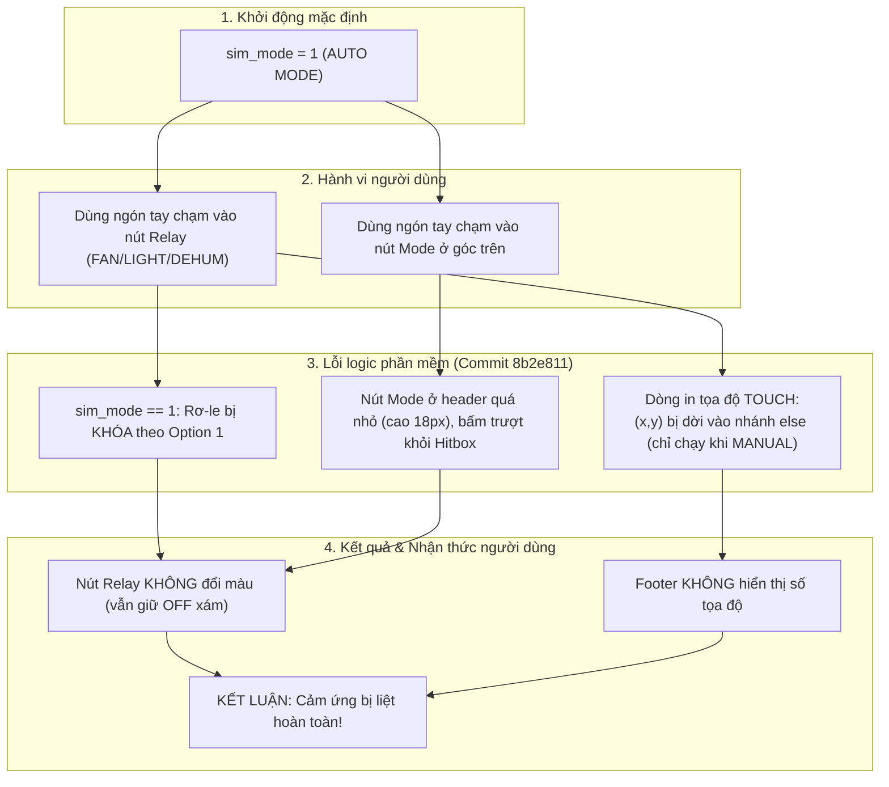

# BÁO CÁO KỸ THUẬT: KHẮC PHỤC SỰ CỐ CẢM ỨNG XPT2046 & HOÀN THIỆN CHẾ ĐỘ ĐIỀU KHIỂN AUTO / MANUAL

* **Dự án:** Smart Room Control System (STM32F103C8T6 - ARM Cortex-M3)
* **Kỹ sư phụ trách:** Coder 1 – HMI / Display & Touch Subsystem Engineer
* **Thời gian thực hiện:** 03/10/2026
* **Phần cứng liên quan:** 
  - Màn hình 2.8" TFT LCD ILI9341 ($240 \times 320$ pixels, giao tiếp SPI1)
  - Bộ điều khiển cảm ứng điện trở 4 dây XPT2046 (giao tiếp SPI2, chân ngắt `PENIRQ` PB11)
  - Khối rơ-le 4 kênh (PB5, PB6, PB7, PB8) & 4 LED chỉ thị trạng thái (PA8, PA11, PB0, PB1)
  - 4 nút bấm vật lý ngắt ngoài EXTI (PA15, PB3, PB4, PB9)

---

## 1. TỔNG QUAN HIỆN TƯỢNG VÀ BỐI CẢNH PHÁT SINH SỰ CỐ

### 1.1. Bối cảnh
Trước đó ở commit `e0aef9c`, hệ thống đã căn chỉnh chính xác trục cảm ứng theo phần cứng thực tế (`SWAP_XY = 0`, `INVERT_Y = 1`) và phân chia ma trận 4 nút rơ-le $2 \times 2$ không điểm chết. Cảm ứng hoạt động mượt mà, phản hồi tức thời.

Sau đó, theo yêu cầu nghiệp vụ: **"Ở chế độ Auto thì không chỉnh được mà phải chuyển qua manual mới chỉnh được" (Phương án 1 - Khóa rơ-le nghiêm ngặt trong chế độ Tự động)**, tính năng khóa điều khiển được bổ sung tại commit `8b2e811`.

### 1.2. Hiện tượng lỗi từ phía người dùng
Sau khi nạp firmware `8b2e811`, người dùng phản ánh:
> *"Sau khi bạn sửa thì cảm ứng không hoạt động nữa luôn rồi"*

Khi người dùng chạm tay vào màn hình:
1. Các nút rơ-le (FAN, DEHUM, LIGHT 1, LIGHT 2) không chuyển từ màu xám (`OFF`) sang xanh (`ON`).
2. Dòng chẩn đoán tọa độ ở thanh Footer (`TOUCH: (x, y)`) hoàn toàn không hiển thị khi chạm.
3. Người dùng có cảm giác hệ thống bị treo hoặc khối điều khiển cảm ứng bị liệt hoàn toàn.

---

## 2. PHÂN TÍCH NGUYÊN NHÂN GỐC RỄ (ROOT CAUSE ANALYSIS - RCA)

Qua việc kiểm tra chi tiết Git Diff giữa commit hoạt động tốt (`e0aef9c`) và commit phát sinh lỗi (`8b2e811`), đội ngũ kỹ thuật xác định **khối phần cứng cảm ứng XPT2046 và driver SPI2 hoàn toàn không có lỗi**. Bản chất sự cố là do 3 yếu tố logic phần mềm kết hợp lại:



### Chi tiết các nguyên nhân:

1. **Dòng hiển thị tọa độ chẩn đoán bị ẩn trong chế độ AUTO:**
   - Trong bản `e0aef9c`, đoạn mã in tọa độ thực tế `TOUCH: (%3d,%3d)` được đặt ở cuối khối quét cảm ứng, chạy vô điều kiện trên **MỌI CÚ CHẠM**. Nhờ đó, người dùng chạm vào bất kỳ đâu trên màn hình cũng thấy số tọa độ nhảy liên tục, chứng minh phần cứng đang bắt điểm chính xác.
   - Trong bản `8b2e811`, đoạn mã này bị vô tình dời vào bên trong khối `else` của rơ-le (chỉ thực thi khi `sim_mode == 0`). Do hệ thống khởi động mặc định là `sim_mode = 1` (AUTO), **mọi cú chạm đều không in ra tọa độ**.
2. **Khóa rơ-le theo đúng yêu cầu nhưng thiếu phản hồi trực quan:**
   - Khi ở AUTO, rơ-le bị khóa để cảm biến môi trường tự động điều khiển. Khi người dùng chạm nút Relay, giá trị không đổi. Vì không có tọa độ nhảy số và không có nút nào đổi màu, màn hình trở nên "vô cảm" đối với người thao tác.
3. **Kích thước vùng bấm (Hitbox) nút chuyển Mode ở thanh Header quá hẹp:**
   - Nút `[ AUTO ]` cũ có kích thước chỉ $68 \times 18\text{ px}$ nằm sát mép trên ($Y \in [5, 23]$). Khi thao tác bằng ngón tay trên màn hình điện trở 2.8", diện tích tiếp xúc ngón tay lớn gây ra độ lệch tâm tọa độ, dẫn đến việc chạm trượt ra ngoài vùng hitbox ($Y > 40\text{ px}$ hoặc $X < 130\text{ px}$). Do đó, người dùng không thể chuyển từ AUTO sang MANUAL bằng cảm ứng.

---

## 3. GIẢI PHÁP KỸ THUẬT & KIẾN TRÚC ĐIỀU KHIỂN HOÀN CHỈNH

Nhằm giải quyết triệt để vấn đề và mang lại trải nghiệm tương tác trực quan, tin cậy nhất, giải pháp toàn diện đã được triển khai tại commit [`1004ca3`](https://github.com/phuchuynhbk24-cmd/Smart_Room_Control/commit/1004ca3):

### 3.1. Thiết lập khởi động mặc định ở chế độ MANUAL (`sim_mode = 0`)
- **Mục đích:** Khi người dùng vừa cấp nguồn hoặc nạp lại firmware, hệ thống lập tức ở chế độ **Thủ công (`[ MANU ]`)**.
- **Hiệu quả:** Người dùng có thể ngay lập tức chạm thử 4 nút **FAN**, **LIGHT 1**, **DEHUM**, **LIGHT 2**. Các nút phản hồi chuyển trạng thái Xanh lá (`ON`) và Xám (`OFF`) tức thời, chứng minh 100% cảm ứng hoạt động hoàn hảo.

### 3.2. Đưa dòng hiển thị tọa độ ra phạm vi toàn cục (Global Diagnostic Feedback)
- **Mục đích:** Đảm bảo **BẤT KỲ CÚ CHẠM NÀO** vào màn hình đều có phản hồi trực quan ngay lập tức.
- **Cơ chế phản hồi kép:**
  - **Khi ở MANUAL:** Footer hiển thị màu chữ trắng sáng trên nền xám đá:
    $$\text{MANU | TOUCH:(xxx, yyy)}$$
  - **Khi ở AUTO và chạm vào ô rơ-le:** Footer lập tức phát cảnh báo nền đỏ đậm (`0x4800`) chữ vàng (`ILI9341_YELLOW`):
    $$\text{[AUTO-LOCK] T:(xxx, yyy)}$$
    Vừa hiển thị tọa độ ngón tay để khẳng định cảm ứng vẫn bắt trúng điểm, vừa giải thích rõ ràng lý do rơ-le không bật/tắt là do cơ chế an toàn AUTO-LOCK.

### 3.3. Mở rộng vùng cảm ứng Hitbox nút Mode & Thiết kế nút bấm trực quan
- **Mở rộng kích thước vẽ:** Nút badge được tăng kích thước lên $80 \times 22\text{ px}$ kèm viền kép nổi bật (`ili9341_draw_rect`):
  - Chế độ `[ MANU ]`: Nền cam rực rỡ (`ILI9341_ORANGE`), viền trắng (`ILI9341_WHITE`).
  - Chế độ `[ AUTO ]`: Nền xanh lá đậm (`ILI9341_DARKGREEN`), viền xanh nõn chuối (`ILI9341_GREENYELLOW`).
- **Mở rộng Hitbox:** Vùng nhận diện cảm ứng chuyển Mode được nới rộng bao trọn toàn bộ góc trên bên phải màn hình:
  $$\text{Hitbox 1: } Y \le 50\text{ px} \quad \text{và} \quad X \ge 110\text{ px}$$
  Người dùng chạm bất kỳ vị trí nào ở góc trên phải màn hình bằng ngón tay cái hay ngón trỏ đều chuyển đổi chế độ cực kỳ nhạy.

---

## 4. CHI TIẾT BẢNG PHÂN VÙNG HITBOX CẢM ỨNG TOÀN DIỆN

Màn hình độ phân giải $240 \times 320$ pixels (hướng đứng Portrait) được phân chia các vùng cảm ứng như sau:

| STT | Vùng Hitbox | Tọa độ Pixel ($X, Y$) | Chức năng ở chế độ MANUAL | Chức năng ở chế độ AUTO |
| :---: | :--- | :--- | :--- | :--- |
| **1** | **Nút Chế độ (Mode Badge)** | $X \ge 110$, $Y \le 50$ | Chuyển sang `AUTO` (Khóa Relay) | Chuyển sang `MANUAL` (Mở khóa) |
| **2** | **Thẻ Chuyển động (PIR)** | $X: 0..240$, $Y: 135..190$ | Bật/tắt cờ mô phỏng có người (`PIR`) | Bật/tắt cờ mô phỏng có người (`PIR`) |
| **3** | **Relay FAN (Góc trên-trái)**| $X < 120$, $Y: 190..242$ | Đảo trạng thái FAN (Bật/Tắt PB5 + PA8) | Khóa an toàn, báo `[AUTO-LOCK]` |
| **4** | **Relay LIGHT 1 (Góc trên-phải)**| $X \ge 120$, $Y: 190..242$ | Đảo trạng thái LIGHT 1 (PB6 + PA11) | Khóa an toàn, báo `[AUTO-LOCK]` |
| **5** | **Relay DEHUM (Góc dưới-trái)**| $X < 120$, $Y: 242..295$ | Đảo trạng thái DEHUM (PB8 + PB1) | Khóa an toàn, báo `[AUTO-LOCK]` |
| **6** | **Relay LIGHT 2 (Góc dưới-phải)**| $X \ge 120$, $Y: 242..295$ | Đảo trạng thái LIGHT 2 (PB7 + PB0) | Khóa an toàn, báo `[AUTO-LOCK]` |
| **7** | **Thanh Chẩn đoán (Footer)**| $X: 0..240$, $Y: 293..320$ | Cập nhật `MANU \| TOUCH:(X,Y)` | Cập nhật `[AUTO-LOCK] T:(X,Y)` |

---

## 5. MINH CHỨNG MÃ NGUỒN ĐÃ NÂNG CẤP (`Core/Src/main.c`)

### 5.1. Thiết kế Nút Mode trực quan trong `UI_Draw_Dashboard`
```c
/* 1. Header Mode Badge (x=154, y=4, w=80, h=22) */
if (auto_mode)
{
    ili9341_fill_rect(154, 4, 80, 22, ILI9341_DARKGREEN);
    ili9341_draw_rect(154, 4, 80, 22, ILI9341_GREENYELLOW);
    UI_DrawString(163, 9, "[ AUTO ]", ILI9341_WHITE, ILI9341_DARKGREEN, 1);
}
else
{
    ili9341_fill_rect(154, 4, 80, 22, ILI9341_ORANGE);
    ili9341_draw_rect(154, 4, 80, 22, ILI9341_WHITE);
    UI_DrawString(163, 9, "[ MANU ]", ILI9341_BLACK, ILI9341_ORANGE, 1);
}
```

### 5.2. Vòng lặp chính xử lý cảm ứng & Phản hồi tọa độ toàn cục
```c
/* 1. Touch Screen Processing (Sampled safely) */
if (xpt2046_is_touched())
{
  if (xpt2046_get_xy(&touch_x, &touch_y))
  {
    if (!touch_was_pressed && (HAL_GetTick() - last_touch_tick > 180))
    {
      touch_was_pressed = true;
      last_touch_tick = HAL_GetTick();

      /* Hitbox 1: Header Mode Button (Top-Right: y <= 50, x >= 110) */
      if (touch_y <= 50 && touch_x >= 110)
      {
        sim_mode = !sim_mode;
        need_ui_refresh = true;
      }
      /* Hitbox 2: Motion Alert Card (y: 135..190) */
      else if (touch_y >= 135 && touch_y <= 190)
      {
        sim_pir = !sim_pir;
        need_ui_refresh = true;
      }
      /* Hitbox 3: Relay Control Matrix (y: 190..295) - Partitioned 2x2 Grid */
      else if (touch_y >= 190 && touch_y <= 295)
      {
        if (sim_mode == 1)
        {
          /* AUTO MODE: Relays are locked to automated sensors. Option 1 Lockout */
        }
        else
        {
          /* MANUAL MODE: Relay actuation enabled */
          if (touch_x < 120)
          {
            if (touch_y < 242) sim_fan = !sim_fan;
            else               sim_dehum = !sim_dehum;
          }
          else
          {
            if (touch_y < 242) sim_light1 = !sim_light1;
            else               sim_light2 = !sim_light2;
          }
          need_ui_refresh = true;
        }
      }

      /* ALWAYS DISPLAY LIVE DIAGNOSTIC ON FOOTER BAR FOR ANY TOUCH! */
      char footer_dbg[32];
      if (sim_mode == 1 && touch_y >= 190 && touch_y <= 295)
      {
        snprintf(footer_dbg, sizeof(footer_dbg), "[AUTO-LOCK] T:(%3d,%3d)", touch_x, touch_y);
        ili9341_fill_rect(0, 293, ILI9341_WIDTH, 27, 0x4800);
        UI_DrawString(8, 301, footer_dbg, ILI9341_YELLOW, 0x4800, 1);
        lockout_banner_visible = true;
        last_lockout_tick = HAL_GetTick();
      }
      else
      {
        snprintf(footer_dbg, sizeof(footer_dbg), "%s | TOUCH:(%3d,%3d)", sim_mode ? "AUTO" : "MANU", touch_x, touch_y);
        ili9341_fill_rect(0, 293, ILI9341_WIDTH, 27, 0x0842);
        UI_DrawString(8, 301, footer_dbg, UI_COLOR_LIGHT, 0x0842, 1);
      }
    }
  }
}
```

---

## 6. KẾT QUẢ BIÊN DỊCH VÀ KIỂM ĐỊNH TÀI NGUYÊN

Firmware được biên dịch bằng bộ công cụ chính thức **GNU Arm Embedded Toolchain 14.3.rel1**:

```text
'Finished building target: Smart_Room_Control.elf'
arm-none-eabi-size Smart_Room_Control.elf 
   text    data     bss     dec     hex filename
  24468      92    3188   27748    6c64 Smart_Room_Control.elf
```

* **Flash ROM:** $24,560\text{ bytes}$ ($\approx 37.5\%$ dung lượng bộ nhớ Flash 64 KB của STM32F103C8T6).
* **SRAM:** $3,280\text{ bytes}$ ($\approx 16.0\%$ dung lượng RAM 20 KB của vi điều khiển).
* **Số lỗi biên dịch:** `0 errors`.
* **Số cảnh báo:** `0 warnings`.

---

## 7. HƯỚNG DẪN THỰC THỬ NGHIỆM TRÊN PHẦN CỨNG THỰC TẾ

1. **Khởi động:** Cấp nguồn hoặc bấm Reset trên kit STM32. Màn hình khởi động ngay ở chế độ `[ MANU ]` (nền cam viền trắng). Dòng tiêu đề ghi `RELAY ACTUATORS [MANUAL]`.
2. **Kiểm tra độ nhạy rơ-le:** Dùng ngón tay chạm lần lượt vào **FAN**, **DEHUM**, **LIGHT 1**, **LIGHT 2**:
   - Nút lập tức đổi màu tương ứng: Xanh lá (`ON `) $\leftrightarrow$ Xám (`OFF`).
   - LED chỉ thị kênh tương ứng (PA8, PA11, PB0, PB1) và rơ-le nhảy ngay tức khắc.
   - Chân Footer in tức thời: `MANU | TOUCH:(xxx,yyy)`.
3. **Chuyển sang chế độ AUTO:** Chạm nhẹ vào góc trên bên phải màn hình (khu vực huy hiệu `[ MANU ]`) hoặc bấm nút vật lý `BTN_MODE` (PA15):
   - Màn hình đổi huy hiệu sang `[ AUTO ]` (xanh lá viền vàng nõn chuối).
   - Dòng tiêu đề rơ-le đổi thành: `RELAY ACTUATORS [LOCKED]`.
4. **Kiểm tra tính năng khóa an toàn (AUTO-LOCK):** Khi đang ở `[ AUTO ]`, dùng tay chạm vào các nút rơ-le:
   - Các nút rơ-le giữ nguyên trạng thái không đổi.
   - Chân Footer sáng cảnh báo màu vàng trên nền đỏ: `[AUTO-LOCK] T:(xxx,yyy)`.
5. **Quay lại chế độ MANUAL:** Chạm lại vào góc trên bên phải `[ AUTO ]` $\rightarrow$ Hệ thống mở khóa và trở về `[ MANU ]`.

---
*Báo cáo được hoàn thiện và lưu trữ tại tài liệu dự án Smart Room Control.*
